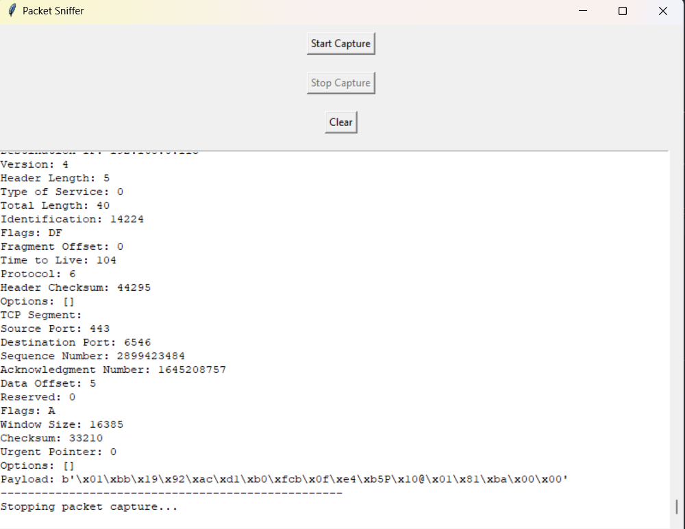

# Packet Sniffer

The Packet Sniffer is a Python application built with Tkinter and Scapy that captures and analyzes network packets. It displays detailed information such as source and destination IP addresses, protocols, and payload data.

## Features

- **Start Capture**: Begin capturing network packets in real-time.
- **Stop Capture**: Stop the packet capture process.
- **Clear Output**: Clear the displayed packet information.
- **Packet Details**: View Ethernet, IP, TCP, UDP, ICMP, and ARP packet details including headers and payload.
- 
## Screenshot

## Installation

1. **Clone the repository**:
    ```sh
    git clone https://github.com/chirag2103/PacketSniffer.git
    ```
   
2. **Navigate to the project directory**:
    ```sh
    cd PacketSniffer
    ```
   
3. **Install dependencies**:
    The application requires Python 3 and the following libraries:
    ```sh
    pip install tkinter scapy
    ```

## Usage

1. **Run the application**:
    ```sh
    python packet_sniffer.py
    ```
   
2. **Capture Packets**:
    - Click on **Start Capture** to begin capturing network packets.
    - The captured packets will be displayed in the scrollable text area.
    - Specific details such as Ethernet frame, IP packet, TCP/UDP segments, ICMP packets, and ARP packets are shown.
    - Payload data for each packet is also displayed.

3. **Stop and Clear**:
    - Click on **Stop Capture** to halt the packet capture process.
    - Use **Clear** to remove all displayed packet information from the text area.

## Example

```plaintext
Packet Sniffer
-------------------------------

Menu:
1. Start Capture
2. Stop Capture
3. Clear

Ethernet Frame:
Source MAC: 00:0c:29:4f:8a:62
Destination MAC: 00:50:56:f7:57:61

IP Packet:
Source IP: 192.168.1.100
Destination IP: 8.8.8.8
Version: 4
Header Length: 20
Type of Service: 0
Total Length: 84
...

--------------------------------------------------
